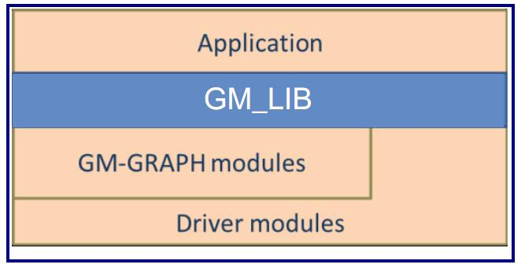

# 1.1 简介

`GM_LIB`为使用者在用户层提供智源媒体操作的功能接口.
用户可以使用该库方便地实现预览,录像,回放.
应用程序通过`GM_LIB`与底层交互.
在智源的媒体IC系统中, `GM_LIB`是`GM_GRAPH`的一部分, `GM_GRAPH`使所有的模块联系在一起.

对每一层描述:

* **Application**: 基于`GM_LIB`的用户层的应用.
* **GM_LIB**: 负责响应来自用户层应用的请求, 转换用户层与`GM_GRAPH`或者驱动层的请求.
* **GM_GRAPH**: 
* **Driver modules**: 